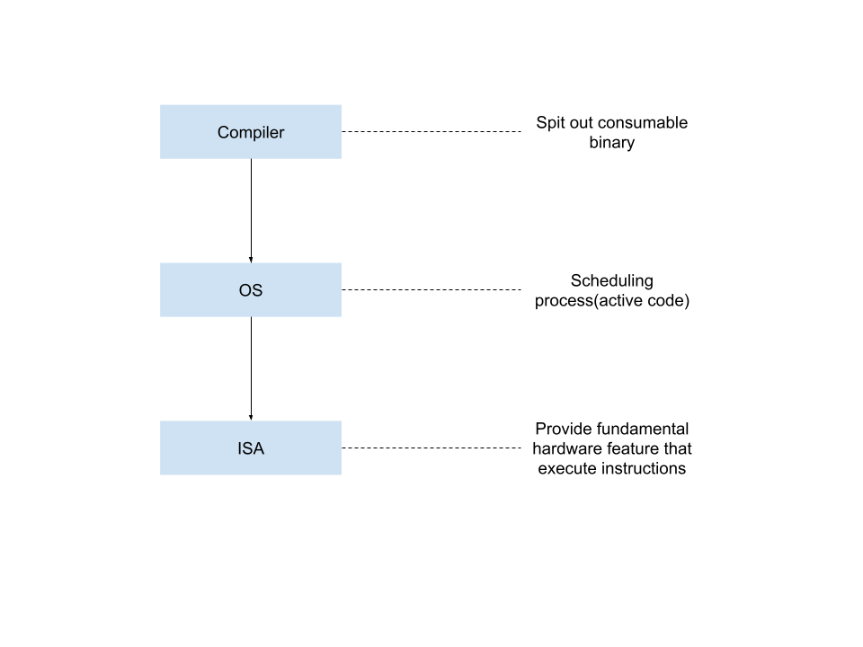

# computer-architecture-playground

This repo is used to document computer architecture related learning.

- [pipeline](./pipeline.md)

    > Learn about cpu pipeline 

- [compiler](./compiler/Readme.md)

- [assembly-language](./assembly-language/Readme.md)

- [compiling-assembling-linking](./compiling-assembling-linking/Readme.md)

    > This demonstrate the process of compiling-assembling-linking with a simple example.

- compiler-OS-ISA relationship

    

- [CrashCourse  / Computer Science](https://www.youtube.com/playlist?list=PL8dPuuaLjXtNlUrzyH5r6jN9ulIgZBpdo)

    > Intuitive computer science video content 
