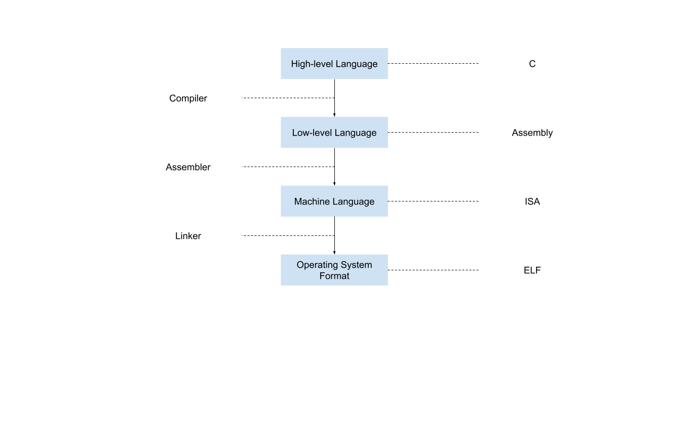

This file is used to understand the process of compiling from high level langauge like C to low level language like assembly or machine code.

Requirement:

- OS: Centos 8

    `docker run -it centos:8`

Content:

- [clang](./clang/Readme.md)

- [llvm](./llvm/Readme.md)

- an architecture digram

    

# Reference

1. [5. C to Assembly](https://www.youtube.com/watch?v=wt7a5BOztuM)

    > This is a lecture from course "MIT 6.172 Performance Engineering of Software Systems, Fall 2018"

2. [Intermediate Representations](https://cs.lmu.edu/~ray/notes/ir/)

    > This give an explanation of what IR is.

3. [Compiling, assembling, and linking](https://www.youtube.com/watch?v=N2y6csonII4)

    > This video explains how compiler, assembler and linker work together with a simpler example.
