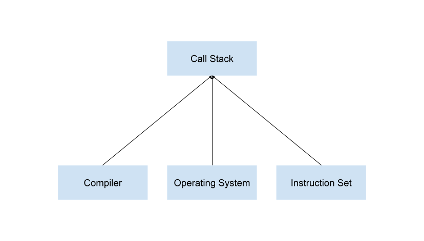

- **To understand call stack intuitively, need to be able to manipulate stack with x86 assembly.**

- **To write better stack manipulation assembly code, need to be comformatable with writing assembly in the first place.**

- **In conclusion, more assembly code practice is needed**

- Refer to this repo for more assembly practice. [xuyuji9000/assembly-playground](https://github.com/xuyuji9000/assembly-playground)

--------------------------------------------

--------------------------------------------

> call stack implementation dependencies

- Relevant concepts: cpu program counter, calling convention, stack frame

- How to manipulate stack in x86 assembly?

# Reference

1. [The Call Stack](https://www.youtube.com/watch?v=Q2sFmqvpBe0)

    > This provides an intuitive video explanation of how call stack works.

2. [Breaking Down the Call Stack](https://medium.com/@ryanfarney/breaking-down-the-call-stack-e68b5633fbad)

    > Detailed explanation of call stack in text

5. [Call stack](https://en.wikipedia.org/wiki/Call_stack)

    > Structured description of call stack on wikipedia

6. [calling-conventions](./calling-conventions.md)
